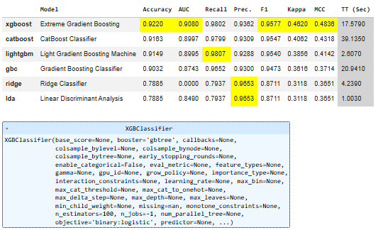
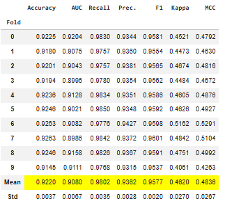
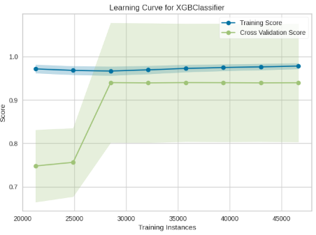

# Drinking Water Feasibility Prediction

This repository presents a machine learning project to predict
whether household drinking water is feasible for consumption
based on structured household and environmental features.

The project is developed as a portfolio artifact to demonstrate
an end-to-end machine learning workflow on tabular data.

---

## 🏆 Competition Context
This project was developed for the **Water Feasibility Prediction – GAMMAFEST**
competition hosted on Kaggle.

The task is a **binary classification problem** with two target classes:
- **Layak Minum** (Feasible)
- **Tidak Layak Minum** (Not Feasible)

Model performance is evaluated using **F1-score**, which is suitable
for imbalanced classification problems.

---

##  Dataset
The dataset consists of structured household-level and environmental features
provided by the competition organizers.

Files included:
- `train.csv`: training data with target labels
- `test.csv`: test data without labels
- `sample_submission.csv`: submission format

---

##  Workflow
The machine learning workflow implemented in this project follows these steps:

1. Data loading and initial inspection
2. Data quality checks and preprocessing
3. Identification of target variable and class imbalance
4. Automated model benchmarking using PyCaret
5. Model comparison and selection based on F1-score
6. Final model training and prediction

This workflow reflects a practical and reproducible approach
commonly used in applied data science projects.

---

##  Modeling Approach (PyCaret AutoML)
This project utilizes **PyCaret**, a low-code machine learning library,
to perform **automated model training and benchmarking**.

PyCaret is used to:
- preprocess the dataset
- handle class imbalance
- train multiple classification models
- compare model performance efficiently

The following models were evaluated during the AutoML process:
- Logistic Regression
- Random Forest
- LightGBM
- CatBoost
- **XGBoost**

The final model was selected based on **F1-score**.

---

## 📊 Results
The best-performing model selected by PyCaret was **XGBoost**, achieving:

- **F1-score:** **95.78%** on validation data

This result demonstrates strong predictive performance
despite the presence of class imbalance in the dataset.

---
## 📈 Model Evaluation Evidence

**Model Benchmarking (PyCaret AutoML):**  
The following leaderboard shows a comparison of multiple classification models.
XGBoost achieved the highest F1-score among the evaluated models.

---

**Cross-Validation Performance (F1-score):**  
Cross-validation results indicate stable performance across multiple folds.

---

**Learning Curve (Generalization Behavior):**  
The learning curve demonstrates that the model generalizes well,
with a small gap between training and validation performance.

## ⚠️ Notes
- This repository is intended as a **portfolio project** showcasing
  an end-to-end machine learning workflow using **AutoML tools (PyCaret)**.
- The notebook is intentionally kept **clean with minimal output**
  to improve readability and maintainability.
- Key results and insights are **summarized in this README**
  rather than relying on notebook output rendering.
- Original competition notebooks use PyCaret widget outputs
that cannot be rendered directly on GitHub.

---

## 👤 Author
**Muhammad Rauf**  
Machine Learning & Data Science
